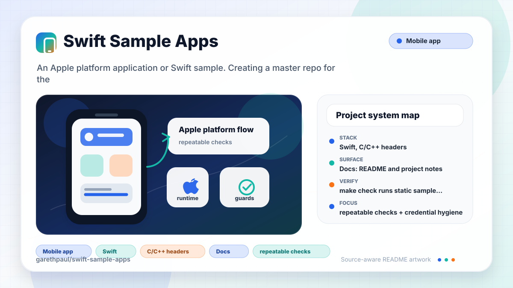

# swift-sample-apps

<!-- README-OVERVIEW-IMAGE -->


## Overview

`garethpaul/swift-sample-apps` is an Apple platform application or Swift sample. Creating a master repo for the slew of random iOS apps. 

This README is based on the checked-in source, manifests, scripts, and repository metadata on the `master` branch. The project language mix found during review was: Swift (25), C/C++ headers (2).

## Repository Contents

- `README.md` - project overview and local usage notes
- `background_switcher` - source or example code
- `basic-note-taker` - source or example code
- `CHANGES.md` - maintenance history for sample hygiene checks
- `Makefile` - local verification entry points
- `docs/plans` - completed maintenance plans for the current baseline
- `facebook-login` - source or example code
- `parse_example` - source or example code
- `plans` - historical implementation notes
- `scripts` - static sample inventory and hygiene validators
- `SECURITY.md` - security reporting and disclosure guidance
- `swift-objects-example` - source or example code
- `todo-list` - source or example code
- `VISION.md` - project direction and maintenance guardrails

Additional scan context:

- Source directories: background_switcher, basic-note-taker, facebook-login, parse_example, swift-objects-example, todo-list
- Dependency and build manifests: none detected
- Entry points or build surfaces: none detected
- Test-looking files: background_switcher/background_switcherTests/Info.plist, background_switcher/background_switcherTests/background_switcherTests.swift, basic-note-taker/basic-note-takerTests/Info.plist, basic-note-taker/basic-note-takerTests/basic_note_takerTests.swift, facebook-login/facebook-loginTests/Info.plist, facebook-login/facebook-loginTests/facebook_loginTests.swift, parse_example/parse_exampleTests/Info.plist, parse_example/parse_exampleTests/parse_exampleTests.swift, and 4 more

## Sample Index

| Sample | Purpose | Required services or SDKs | Current verification |
| --- | --- | --- | --- |
| `background_switcher` | Responsive, accessible background selection with current Swift behavior tests. | None. | Portable source checks, standalone Swift tests, native XCTest, and a current Xcode build canary. |
| `basic-note-taker` | In-memory note list and editor using legacy table-view patterns. | None. | Static archive checks only; its historical Swift/Xcode toolchain is not pinned. |
| `facebook-login` | Legacy Facebook login and optional profile display flow. | Legacy Facebook iOS SDK plus developer-local app configuration; never commit app credentials. | Static archive checks only because the SDK is not checked in. |
| `parse_example` | Legacy Parse object-save callback example. | Legacy Parse iOS SDK plus developer-local application ID and client key; checked-in values are placeholders. | Static archive checks only because the SDK is not checked in. |
| `swift-objects-example` | UIKit control catalog with local-only web-view content. | None. | Static archive checks only; its historical Swift/Xcode toolchain is not pinned. |
| `todo-list` | In-memory task entry, display, and deletion sample. | None. | Static archive checks only; its historical Swift/Xcode toolchain is not pinned. |

Only `background_switcher` is maintained as a current build and native-test
canary. The remaining projects are preserved as legacy source examples and
must not be treated as production-ready or currently buildable without their
historical toolchains.

## Getting Started

### Prerequisites

- Git
- macOS with Xcode for building Apple platform projects
- Python 3 for repository source checks

### Setup

```bash
git clone https://github.com/garethpaul/swift-sample-apps.git
cd swift-sample-apps
```

The setup commands above are derived from repository files. Legacy mobile, Python, or JavaScript samples may require older SDKs or package versions than a modern workstation uses by default.

## Running or Using the Project

- Open the Xcode project or workspace in Xcode and run the matching app/sample scheme.
- Consult the sample index before opening a project; Facebook and Parse require
  legacy SDKs and developer-local configuration that are intentionally absent.

## Testing and Verification

- `make check` runs static sample inventory checks and confirms generated
  Xcode user state is not tracked. It also scans tracked text files for known
  credential-like sample markers, tokenized URLs, and synchronous URL-backed
  image loads. Swift source checks also reject literal insecure `http://` URL
  requests so archive web-view demos stay local or use explicit HTTPS
  placeholders, active `print`/`println` debug logging, and Facebook login
  error handlers that discard or force-unwrap the delegate error. The checks
  also require the Parse sample save callback to inspect errors before
  reporting completion, the basic note sample to guard stale table indexes
  before reading or writing notes, and the todo-list sample to guard stale
  table indexes before reading or removing tasks. The swift-objects sample also
  guards stale table indexes before reading item titles. Xcode project
  checks reject developer-local framework and bridging-header paths. When
  `xcodebuild` is installed, the `build` target compiles the self-contained
  `background_switcher` canary for a generic iOS Simulator. Parse and Facebook
  samples remain static-only because their legacy SDK frameworks are absent.
- `make native-test` executes the checked-in `background_switcherTests` XCTest
  target on the latest installed iPhone 16 Pro simulator. `make check` includes
  this gate when Xcode is available and reports an explicit skip otherwise.
- `make root-test` exercises repository-root, shell, Make metadata, trusted
  tool-value, and non-executing-mode authority without requiring Xcode or Swift.
- GitHub Actions runs portable checks on Ubuntu 24.04 and the Swift 5/iOS 12
  background-switcher build canary on macOS 15; both jobs use credential-free
  checkout.
- The background-switcher canvas and image follow the view bounds on different
  simulator sizes and rotations. Its centered controls use safe-area
  constraints, 44-point minimum targets, padding, and Dynamic Type text.
- Background changes use one interruptible cross-dissolve, so rapid taps keep
  the latest selected color instead of allowing stale completion writes.
- Background selection semantics keep one button selected and expose the same
  state through the selected accessibility trait.
- Background selection behavior executes the production button-tag mapping for
  both valid choices and fail-closed invalid tags on a standard Swift compiler.
- Reduce Motion background changes apply the selected color immediately while
  retaining the interruptible cross-dissolve for other users. Runtime preference
  changes cancel an active transition and settle on the latest selected color.
- Facebook user profile payloads are optional-cast before UI updates, malformed
  profiles clear stale values, and user-cancelled login does not show an empty
  alert.
- Hygiene checks also require completed canonical plans under `docs/plans`.
- GitHub Actions runs the same portable hygiene and sample checks on Python
  3.12 for pushes and pull requests on fixed Ubuntu 24.04, with immutable
  actions, read-only permissions, disabled checkout credential persistence,
  concurrency cancellation, and bounded runtime.
- Makefile verification is rooted at the repository path and can be invoked
  from an external working directory.
- Xcode's test action or `xcodebuild test` with the appropriate scheme and
  destination can be used on macOS for deeper verification.

When the required SDK or runtime is unavailable, use static checks and source review first, then verify on a machine that has the matching platform toolchain.

## Configuration and Secrets

- No required secret or credential file was identified in the repository scan. If you add integrations later, keep secrets out of git.
- Facebook and Parse examples should keep app IDs, client keys, and access
  tokens in local setup only; checked-in examples should use placeholders or
  non-secret sample URLs.
- Facebook and Parse SDK frameworks should be supplied locally under each
  sample's `Frameworks` directory when opening those archived projects in Xcode.

## Security and Privacy Notes

- Review changes touching authentication or token handling; examples from the scan include background_switcher/background_switcher/ViewController.swift, facebook-login/Info.plist, facebook-login/Swift.h, facebook-login/facebook-login/AppDelegate.swift, and 4 more.
- Review changes touching network requests, sockets, or service endpoints; examples from the scan include background_switcher/background_switcher/Info.plist, background_switcher/background_switcher/ViewController.swift, background_switcher/background_switcher.xcodeproj/xcuserdata/gjones.xcuserdatad/xcschemes/xcschememanagement.plist, background_switcher/background_switcherTests/Info.plist, and 6 more.
- Review changes touching mobile permissions or privacy-sensitive device data; examples from the scan include facebook-login/facebook-login/ViewController.swift.
- Review changes touching file, media, JSON, XML, CSV, OCR, or data parsing; examples from the scan include background_switcher/background_switcher/Info.plist, background_switcher/background_switcher/ViewController.swift, background_switcher/background_switcher.xcodeproj/xcuserdata/gjones.xcuserdatad/xcschemes/xcschememanagement.plist, background_switcher/background_switcherTests/Info.plist, and 6 more.

## Maintenance Notes

- This looks like an Apple platform project or sample. Xcode, Swift, CocoaPods, and deployment target versions may need to match the original project era.
- See `SECURITY.md` for vulnerability reporting and safe research guidance.
- See `VISION.md` for project direction and contribution guardrails.
- See `docs/plans/2026-06-08-swift-sample-apps-baseline.md` for the canonical
  sample archive hygiene baseline.
- See `docs/plans/2026-06-08-no-sync-image-downloads.md` for the synchronous
  image download guard.
- See `docs/plans/2026-06-08-local-webview-content.md` for the local web-view
  sample guard.
- See `docs/plans/2026-06-09-debug-print-guard.md` for the Swift debug print
  guard.
- See `docs/plans/2026-06-09-facebook-error-handling.md` for the Facebook login
  error handling guard.
- See `docs/plans/2026-06-09-local-xcode-paths.md` for the Xcode framework path
  placeholder guard.
- See `docs/plans/2026-06-09-parse-save-error-handling.md` for the Parse save
  callback error handling guard.
- See `docs/plans/2026-06-09-note-index-guard.md` for the basic note table
  index guard.
- See `docs/plans/2026-06-09-todo-index-guard.md` for the todo-list table
  index guard.
- See `docs/plans/2026-06-09-swift-objects-index-guard.md` for the
  swift-objects table index guard.
- See `docs/plans/2026-06-10-facebook-payload-and-ci.md` for Facebook payload
  validation, cancellation behavior, and the CI gate.
- See `docs/plans/2026-06-10-responsive-background-switcher.md` for the
  responsive canary layout contract.
- See `docs/plans/2026-06-13-background-selection-semantics.md` for exclusive
  selected-state accessibility coverage.
- See `docs/plans/2026-06-14-make-root-override-protection.md` for authoritative
  repository-root selection across all Make aliases.
- See `docs/plans/2026-06-21-make-authority-isolation.md` for quoted checkout
  paths, fixed shell authority, Make mode rejection, and startup boundaries.
- See `docs/plans/2026-06-14-background-reduce-motion.md` for the system motion
  preference behavior of successful background selections.
- See `docs/plans/2026-06-16-background-selection-swift-tests.md` for the
  executable button-tag mapping boundary.
- See `docs/plans/2026-06-19-background-test-execution-contract.md` for the
  static guarantee that the compiled selection test binary is executed.
- See `docs/plans/2026-06-19-background-native-deep-review.md` for the native
  XCTest, accessibility, animation ownership, and Reduce Motion review.

## Contributing

Keep changes small and tied to the project that is already present in this repository. For code changes, document the toolchain used, avoid committing generated dependency directories or local configuration, and update this README when setup or verification steps change.
